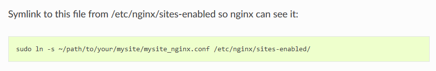

> **在配置uWSGI与Django的过程中，查询uWSGI官方文档照葫芦画瓢，但有一处笔误导致我这个菜鸡踩坑:**

>重启nginx提示:[emerg] open() "/etc/nginx/sites-enabled/mysite_nginx.conf" failed (2: No such file or directory) in /etc/nginx/nginx 
> **在这里建立的软连接应该为：**
>sudo ln -s ~/etc/nginx/sites-available/mysite_nginx.conf /etc/nginx/sites-enabled/
